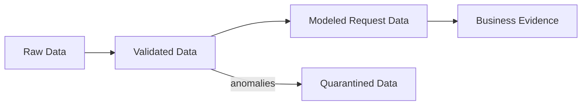
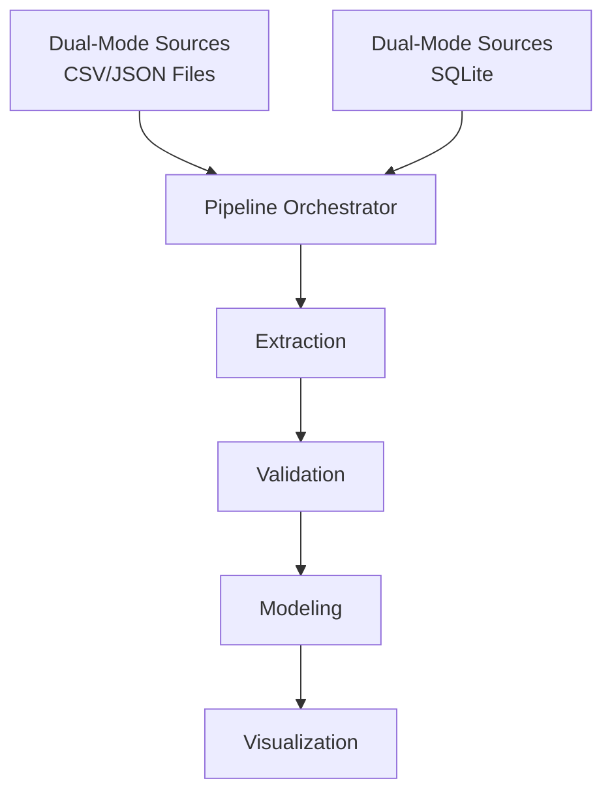

# Student Alert Intake Analytics & Centralized Request System Evidence

## Business objective
This repository implements a full-stage data engineering pipeline to measure the operational burden created by the shared student alert inbox and to produce evidence for the case for a centralized request system. The workflow is intentionally evidence-first: raw inbox records are extracted, validated, reconstructed into request lifecycles, and modeled into a KPI that measures the percentage of requests resolved without requiring a student to follow up again.

The goal is not simply to add a chatbot or route messages more efficiently. The objective is to show, with operational evidence, that the current shared inbox is fragmented, poorly resolved, and creates recurring additional burden on students who must re-contact the system by phone, walk-in, or repeated email threads. The resulting KPI and evidence package supports a centralized request system as a process and service improvement, not just a conversational layer.

This project follows strict FDE principles. Broken, missing, malformed, or ambiguous source records are preserved in quarantine and reported clearly rather than silently repaired. That preserves the integrity of the evidence and makes the operational problem visible in a defensible, audit-friendly way.

## KPI definitions
The headline KPI for this project is:

- Percentage of resolved requests without a student follow-up = resolved requests with no follow-up / resolved requests * 100

The model counts a request as:
- Resolved when it is matched to a downstream operational resolution event for the same student after the request was submitted
- Follow-up required when the student must re-engage through phone, walk-in, or follow-up contact after the original submission
- Unresolved or Black-Hole when a request is older than the observation window and no valid downstream resolution is found
- Censored when a request is still within the active observation window and therefore not yet mature enough to judge conclusively

This KPI is intentionally computed only over requests with a confirmed resolution, because including all requests in the denominator would hide the difference between a truly resolved case and one that simply has not had enough time to complete. The evidence package reports both the numerator and the denominator to keep the operational interpretation transparent.

## Source data and extraction

| Source | Retrieval mode | Input path | Description |
| --- | --- | --- | --- |
| Student inbox | CSV file parsing | `data/raw/raw_student_alert_inbox_final.csv` | Primary inbox evidence for student requests, message metadata, timestamps, and request threads |
| Student directory | CSV file parsing | `data/raw/student_directory_master.csv` | Identity crosswalk used to resolve `student_id` and `enrollment_number` references |
| API follow-up interactions | JSON file parsing | `data/raw/api_student_interactions.json` | Mixed-schema follow-up records such as phone calls, walk-ins, and repeated contact attempts; malformed HTTP-style error envelopes are isolated for review |
| Mess roster updates | CSV file parsing and SQLite querying | `data/raw/mess_roster_updates.csv` and SQLite operational data | One of the downstream resolution sources used to infer when a student's underlying issue was actually closed |
| Finance fee disputes | CSV file parsing and SQLite querying | `data/raw/finance_fee_disputes_Q3.csv` and SQLite operational data | Second downstream resolution source used to confirm closure of a student issue |
| Academic credits master | CSV file parsing and SQLite querying | `data/raw/academic_credits_master.csv` and SQLite operational data | Third downstream resolution source used to confirm academic correction or closeout events |
| SQLite operational evidence | SQLite querying | configured SQLite source files | Structured operational tables used to join student records to downstream resolution events while preserving source fidelity |

The extraction layer uses a dual-retrieval design. CSV and JSON sources are read directly from files, while SQLite-backed operational evidence is queried through the database layer. This allows the pipeline to ingest both file-based operational exports and structured relational records without rewriting the original evidence. The source files are preserved as raw artifacts, and only validated records move forward into the modeled lifecycle.

## Pipeline Architecture

### Data Lifecycle Phases



### System Architecture



## Install, run, and test

```bash
python3 -m venv .venv
source .venv/bin/activate        # .venv\Scripts\activate on Windows
pip install -r requirements.txt
```

From the repository root, with the virtual environment activated:

```bash
python3 -m src.pipeline
```

Run the automated checks:

```bash
pytest
```

The pipeline is designed to be idempotent: rerunning it overwrites outputs cleanly while preserving the audit trail in the logs, validated files, and quarantine datasets. A full run typically completes in a short time, with most of the runtime spent reconstructing per-request matches and downstream resolution events.

## Pipeline Architecture

### Data Lifecycle Phases


### System Architecture


## Data-quality rules and FDE interpretation
The project enforces strict validation logic without silently fixing source problems.

- No Silent Fixes: malformed API payloads, critical null values, invalid identifiers, duplicate inbox entries, and irreconcilable identity rows are quarantined instead of repaired or quietly dropped
- Identity Preservation: unknown or unmapped student addresses remain visible as `Unknown Identity` rather than being filtered out, because the operational burden itself is part of the evidence
- Resolution Matching: each request thread is matched to the earliest downstream resolution event for that student at or after the request submission time; later requests cannot reuse a resolution that already closed an earlier issue
- Time-Travel Handling: if a matched resolution timestamp occurs before the request submission timestamp, the request is flagged and excluded from final KPI math
- Observation-Window Censoring: unresolved requests submitted within the last 48 hours are treated as censored rather than as failures
- Black-Hole Reporting: older unresolved requests with no valid downstream match are counted separately and treated as operational evidence that the inbox is failing to resolve work

These rules ensure the KPI remains mathematically defensible while still reflecting the true operational burden of the shared inbox. The evidence captures the raw problem instead of sanitizing it away, which is the core FDE principle behind this project.

## Known, unknown, assumptions, and limitations

| Category | Statement |
| --- | --- |
| Known | The raw inbox captures student requests, the directory provides identity resolution, and downstream operational systems provide resolution evidence for mess, finance, and academic corrections |
| Known | The pipeline preserves malformed records and isolates them in quarantine so the original operational evidence remains visible and auditable |
| Known | Follow-up contacts from phone, walk-in, or repeated attempts are treated as evidence of additional burden on the student |
| Unknown | The precise underlying reason for a specific unresolved request may not be available from the dataset alone |
| Unknown | No raw source explicitly says "this request was resolved" in the inbox; resolution is inferred from downstream operational events |
| Assumption | Request lifecycles are reconstructed by matching each request to the earliest valid downstream resolution event for the same student at or after the request submission time |
| Assumption | Unknown or unmapped identities are operationally relevant and should not be silently discarded |
| Limitation | The pipeline is batch-oriented rather than streaming, so it is designed for evidence generation rather than real-time operational monitoring |
| Limitation | The model is conservative: unresolved and censored cases are not treated as equal to a successful resolution without follow-up |
| Limitation | The KPI is focused on burden and resolution quality rather than direct causal attribution for every unresolved case |

## Repository map

```text
.
├── README.md
├── requirements.txt
├── src/
│   ├── __init__.py
│   ├── config.py
│   ├── extract.py
│   ├── validate.py
│   ├── model.py
│   ├── pipeline.py
│   └── visualize.py
├── data/
│   ├── raw/
│   │   ├── raw_student_alert_inbox_final.csv
│   │   ├── student_directory_master.csv
│   │   ├── api_student_interactions.json
│   │   ├── mess_roster_updates.csv
│   │   ├── finance_fee_disputes_Q3.csv
│   │   └── academic_credits_master.csv
│   ├── validated/
│   ├── quarantine/
│   └── modeled/
│       ├── student_requests.csv
│       └── kpi_metrics.json
├── findings/
│   ├── 00_source_map_and_workflow_diagram.md
│   ├── 01_dataset_reconnaissance.md
│   ├── 02_inbox_simulation_spec.md
│   ├── 03_extraction_spec.md
│   ├── 04_validation_spec.md
│   ├── 05_modeling_spec.md
│   ├── 06_pipeline_spec.md
│   ├── 07_evidence_spec.md
│   ├── 08_review_findings_and_fixes.md
│   ├── final_business_evidence_2026-09-27.md
│   ├── final_business_evidence_2026-09-28.md
│   └── final_business_evidence.md
├── tests/
│   ├── test_data_integrity.py
│   ├── test_extract.py
│   ├── test_model.py
│   ├── test_pipeline.py
│   ├── test_validate.py
│   └── test_visualize.py
└── .venv/ (local environment, not committed)
```

This repository organizes the workflow into a clear evidence chain: raw fact capture, validation and quarantine, modeled lifecycle reconstruction, and business evidence generation. The result is an auditable operational argument that explains why a centralized request system is needed and how the shared inbox creates avoidable burden on students.
