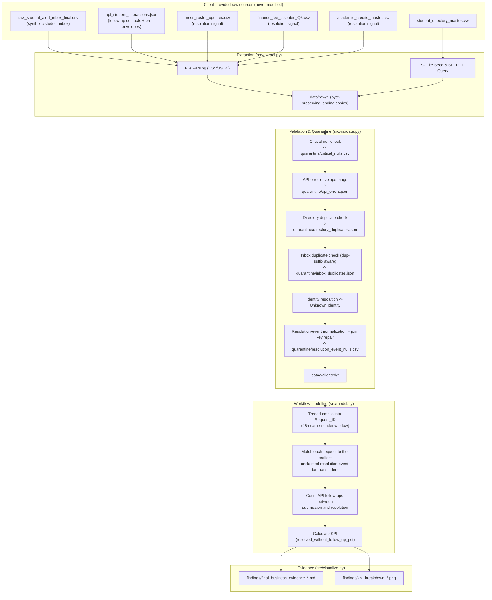
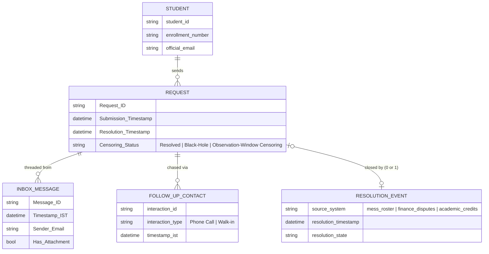

# Source Map & Workflow / Data Model Diagram

This is the single map of "business question -> source system -> pipeline
stage" for the project, required alongside the code. It reflects the
pipeline as it exists after the review fixes described in
`findings/08_review_findings_and_fixes.md`.

## 1. Business questions -> required information -> source systems

| Business question | Required information | Source system | Format / Retrieval Mode | Owner / grain |
|---|---|---|---|---|
| How much of the shared inbox's request volume actually gets closed out? | Request creation events, resolution events | `data/raw_student_alert_inbox_final.csv`, `data/mess_roster_updates.csv`, `data/finance_fee_disputes_Q3.csv`, `data/academic_credits_master.csv` | CSV / Flat File | Registrar mailbox export; mess office; finance office; academic office. One row per message / clearance / dispute / credit action. |
| Who sent the request, and can we identify them? | Sender identity resolution | `data/student_directory_master.csv` | SQLite Database / SQL Query | Registrar's student master. One row per enrolled student. |
| Did the student have to chase the request again? | Follow-up contact events | `data/api_student_interactions.json` | JSON / File parsing | Phone/walk-in logging system. One row per logged contact attempt. |
| (Not yet integrated — see Known/Unknown) | Independent corroboration of "Walk-in" contacts; pre-2024 ticket history | `data/admin_bldg_wifi_auth_logs.csv`, `data/legacy_alert_archive_2024.csv` | CSV / Flat File | Building WiFi controller (keyed by `mac_address`, no student linkage); legacy archive (keyed by `ticket_ref`, no student linkage). |

`Report Ticketing/Report Ticketing.xlsx` is the public admissions-ticket
dataset used to *synthesize* the inbox (see `generate_raw_student_alert_inbox.py`
and `findings/02_inbox_simulation_spec.md`); it is not itself part of the
runtime pipeline's inputs and is left untouched as a protected source.

## 2. Pipeline data flow

## 3. Workflow / entity model

## 4. Known / Unknown / Assumption / Limitation (source-map level)

- **Known**: the SQLite-extracted directory crosswalk (`student_id` <-> `enrollment_number` <-> `official_email`) provides a reliable SQL-retrieved identity table that lets the three resolution-event sources be joined even though they use three different identifier columns.
- **Known**: resolution events cover roughly 87% of the students who sent a
  request (2,181 of 2,500), so the primary KPI is judgeable for a meaningful
  share of traffic, not a token sample.
- **Unknown / not yet integrated**: `admin_bldg_wifi_auth_logs.csv` has no
  student identifier (only `mac_address`), so it cannot currently corroborate
  "Walk-in" follow-up claims without an additional device-to-student mapping
  that does not exist in this dataset. `legacy_alert_archive_2024.csv` is
  keyed by `ticket_ref`, not `student_id`, and only covers 200 rows from
  March 2024, so it was judged out of scope for the current request
  lifecycle rather than force-joined on a guess.
- **Assumption**: a resolution event is attributed to a student's
  *earliest unclaimed* request at or after that event's timestamp (see the
  docstring on `WorkflowModeler.resolve_request_timestamps`). This is the
  single most consequential judgement call in the model, because these
  events are keyed only by student, not by request.
