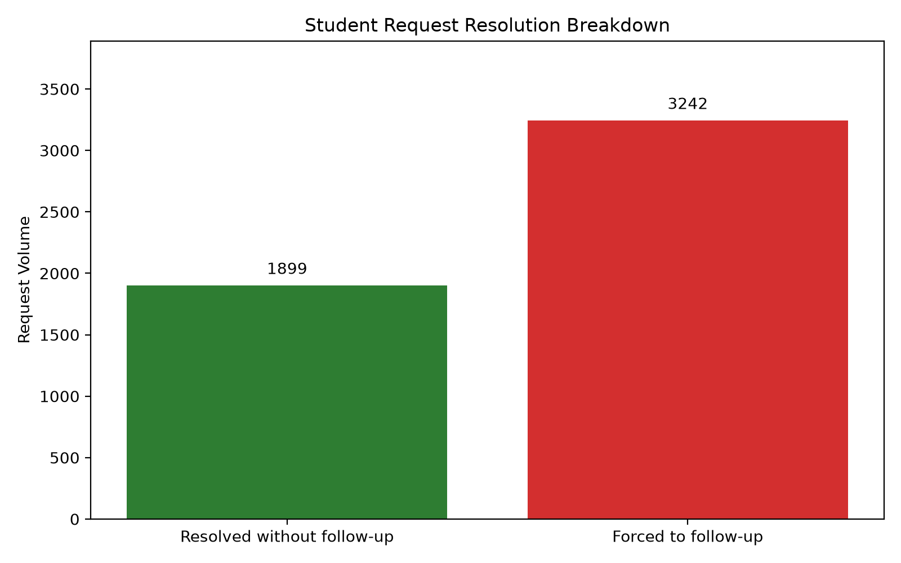

# Final Business Evidence

## Executive Summary

The current shared inbox is creating avoidable operational friction for students and staff. Of 32026 total requests reconstructed from the inbox, only 5141 (16.05%) could be matched to a confirmed resolution event in a downstream system (mess clearance, finance dispute closure, or academic credit action). Among those confirmed requests, 36.94% were resolved without any student follow-up, meaning 63.06% still required the student to chase the issue again through walk-ins or phone calls. The remaining 26885 requests (83.95% of all requests) have no confirmed resolution anywhere in the operational systems we can check, and are treated as Black-Hole cases rather than assumed resolved.

The evidence supports replacing the shared inbox with a centralized request system rather than layering an AI chatbot on top of a broken intake process. The core issue is not simply responsiveness; it is the lack of a reliable request lifecycle, no clear ownership, and no auditable resolution path for student requests.

## Operational Metrics Evidence

| Metric | Value | Interpretation |
| --- | ---: | --- |
| Total requests reconstructed | 32026 | Volume of distinct request threads reconstructed from the inbox |
| Requests with a confirmed resolution event | 5141 | Requests matched to a mess/finance/academic closure record, i.e. judgeable for the primary KPI |
| Percentage resolved with zero student follow-ups | 36.94% | Primary KPI, computed only over requests with a confirmed resolution |
| Percentage requiring student follow-up | 63.06% | Confirmed requests that forced the student to reinitiate contact via walk-ins or phone calls |
| Black-Hole requests | 26885 (83.95%) | Requests with no confirmed resolution in any downstream system; excluded from the primary KPI, reported separately |
| Requests excluded for time-travel anomalies | 0 | Invalid lifecycle records excluded from final KPI math to preserve accuracy |
| Requests from an unresolvable sender identity | 4955 | Requests from an address the student directory could not match, compounding the follow-up burden |
| Requests with a false attachment claim | 5250 | Requests that reference an attached document/receipt that was never actually attached |

## Why this supports a centralized request system

- A centralized request system creates explicit ownership, timestamps, and tracking for each request.
- It prevents the shared inbox from fragmenting the same issue across multiple email threads and repeated outreach.
- It protects the KPI from hidden operational noise such as invalid timestamps and unresolved black-hole cases.
- It creates a measurable service model, which is far more defensible than a chatbot that only responds to messages without fixing the underlying process failure.
